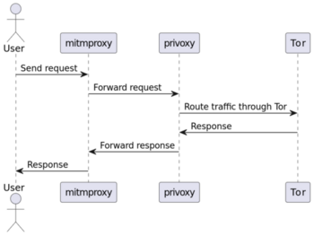

# proxy-rotator

Modern rotating TOR proxy (Currently only supports HTTP)

## Usage

**Create a `.env` file containing the following environment variables:**

```bash
USERNAME=<username>
PASSWORD=<password>
TOR_CONTROL_PORT=<port>
RENEWAL_INTERVAL=<interval> # in seconds
```

**Build and run the Docker container:**

```bash
docker build -t proxy-rotator .
docker run --env-file .env -it -p 8080:8080 proxy-rotator
```

**Test proxy with curl:**

```bash
curl -x http://localhost:8080 -U username:password http://httpbin.org/ip
```

```json
{
  "origin": "rotating-ip"
}
```

## How it works


